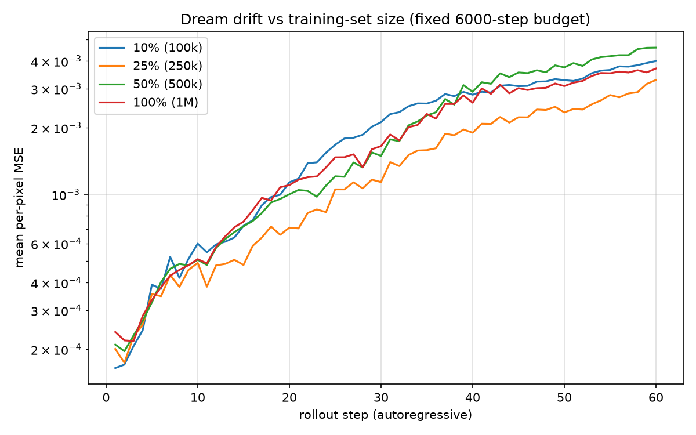

# Training-set-size ablation

World model trained at 10% (100k), 25% (250k), 50% (500k), 100% (1M) of the 1M-transition dataset, each for the SAME 6000-step budget (cap 2700s) on a T4; drift measured over 32 held-out 60-step autoregressive rollouts replaying logged actions.

| data | mse@1 | mse@10 | mse@30 | mse@60 | final train loss |
|------|-------|--------|--------|--------|------------------|
| 10% (100k) | 0.00016 | 0.00060 | 0.00212 | 0.00400 | 0.0008 |
| 25% (250k) | 0.00020 | 0.00049 | 0.00114 | 0.00329 | 0.0009 |
| 50% (500k) | 0.00021 | 0.00051 | 0.00149 | 0.00460 | 0.0012 |
| 100% (1M) | 0.00024 | 0.00051 | 0.00165 | 0.00370 | 0.0012 |

With the step budget held fixed at 6000, rollout coherence scales with data only weakly and only at the low end: the single clear effect is 10% -> 25% at mid-horizons, where mse@30 drops 1.9x (0.00212 -> 0.00114, a ~2-SEM gap over the 32 eval windows). Beyond 250k transitions the curves saturate — the 25/50/100% models are statistically indistinguishable (mse@30 of 0.00114/0.00149/0.00165 against a per-model SEM of ~0.0004, and all four models sit within one SEM of each other at h=60) — so the non-monotonic ordering at large fractions is noise, not signal. The 10% model also posts the LOWEST final train loss (0.0008 vs 0.0012 at 100%) while drifting worst at h=30: with 6000 steps over only 100k transitions it partially memorizes its data and generalizes slightly worse to held-out rollouts — a data-diversity effect, since compute is identical. mse@1 barely separates the models (all 0.00016-0.00024); differences only emerge as autoregressive compounding amplifies them over 20+ steps. For this low-entropy env, ~250k transitions saturates what a 6000-step budget can exploit; more data would presumably only pay off together with more training steps (cf. the 18k-step wm_v1 run).

